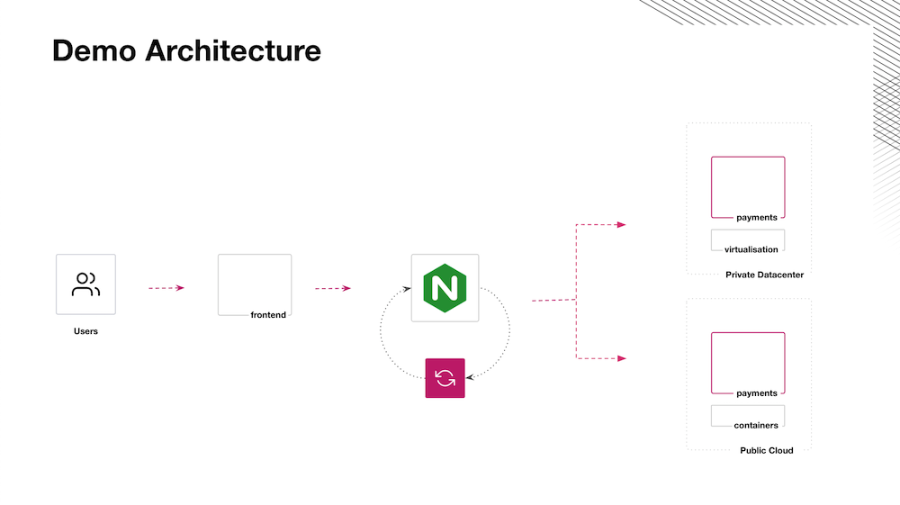

# Consul Blue Green Deployments Demo

This repos deploys Consul and a app as show below.



## Prerequisites
- Working Kubernetes environment.
- `kubectl` binary.
- `helm` binary.

## Installation
I'm using the `demo.sh` as a wrapper around some helm commands, to make the demo easier to drive.
```
sh demo.sh install consul
```

> :warning: **Wait for Consul to finish initalizing and for Consul services to have their IPs assigned before continuing!**

```
sh demo.sh install consul-config
sh demo.sh install monitoring
sh demo.sh install payments-blue
sh demo.sh install payments-green
sh demo.sh install loadbalancer
sh demo.sh install frontend

```


